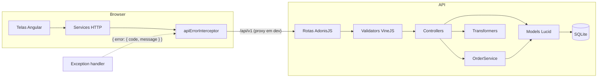

# Arquitetura

## Visão geral

O front nunca fala com o banco nem calcula nada que vale como verdade. Ele manda o que o usuário escolheu (ids e quantidades) e mostra o que a API devolve.

## Backend (`backend/`)

| Pasta | Papel |
|---|---|
| `start/routes.ts` | Todas as rotas, agrupadas em `/api/v1`, com `id` restrito a número |
| `start/validator.ts` | Mensagens de validação em português |
| `app/validators/` | Formato da entrada (VineJS). Nada chega no controller sem passar por aqui |
| `app/controllers/` | Só HTTP: valida, chama quem resolve, serializa a resposta |
| `app/services/order_service.ts` | Regras do pedido: criação em transação, preço congelado, troca de status |
| `app/domain/order_status.ts` | Tabela de transições de status. Função pura, sem banco |
| `app/models/` | Models Lucid com colunas declaradas, relações e o scope `search` |
| `app/transformers/` | Formato de saída de cada recurso (o que vai e o que não vai no JSON) |
| `app/exceptions/` | `DomainException` (erro de regra), as exceções do pedido e o handler global |
| `database/migrations/` | Criação das 4 tabelas, com `up` e `down` |
| `database/seeders/` | Dados de exemplo, criados pelo próprio `OrderService` |
| `providers/api_provider.ts` | Envelope `{ data }` / `{ data, metadata }` das respostas |

### Caminho de uma requisição: criar pedido

1. `POST /api/v1/orders` cai em `OrdersController.store`.
2. `createOrderValidator` confere formato: `customerId` existe, `items` tem pelo menos 1, quantidades inteiras de 1 a 999, sem produto repetido. Falhou → `422 VALIDATION_ERROR`.
3. `OrderService.create` abre uma transação, busca os produtos pelos ids, recusa id inexistente (`PRODUCT_NOT_FOUND`) e produto inativo (`PRODUCT_INACTIVE`), copia o preço de cada produto para o item, soma o total e grava pedido e itens.
4. O pedido é recarregado com cliente e itens e passa pelo `OrderTransformer`, que acrescenta `nextStatuses`.
5. Qualquer exceção no caminho vai para `app/exceptions/handler.ts`, que devolve sempre o mesmo formato de erro.

### Por que só o pedido tem service

Clientes e produtos são cadastro: validar e salvar. Um service para eles repetiria o controller. O pedido tem regra de verdade (cálculo, transação, estado), e é isso que vai para o `OrderService`. Não existe camada de repository porque os models do Lucid já são a camada de acesso a dados.

## Frontend (`frontend/src/app/`)

| Pasta | Papel |
|---|---|
| `core/models/` | Tipos das respostas da API e os rótulos de status em português |
| `core/services/` | Um service por recurso. Único lugar que conhece URLs |
| `core/api/` | `ApiError`, interceptor de erros, montagem de query string, URL base |
| `core/guards/` | `unsavedChangesGuard` |
| `core/notifications/` | Serviço e componente de avisos (toasts) |
| `features/orders/` | Lista, detalhe e novo pedido, mais o `OrderDraft` (pedido em montagem) |
| `features/products/`, `features/customers/` | Lista com busca e formulário de cadastro/edição |
| `shared/` | Pipe de dinheiro, badge de status, paginação, iniciais, helpers de formulário |
| `src/testing/fixtures.ts` | Dados e helpers dos testes de componente |

Detalhes em [frontend.md](frontend.md).

## Como as duas partes se encontram

Em desenvolvimento o Angular roda na porta 4200 e o `proxy.conf.json` repassa `/api` para a 3333. Para o navegador é tudo o mesmo servidor, então CORS não aparece no dia a dia. Fora do modo dev, a API só aceita as origens listadas em `CORS_ORIGIN`.

O contrato entre os dois é o JSON: todo valor com `Cents` no nome é inteiro em centavos dos dois lados, e datas vão em ISO 8601 com fuso.
