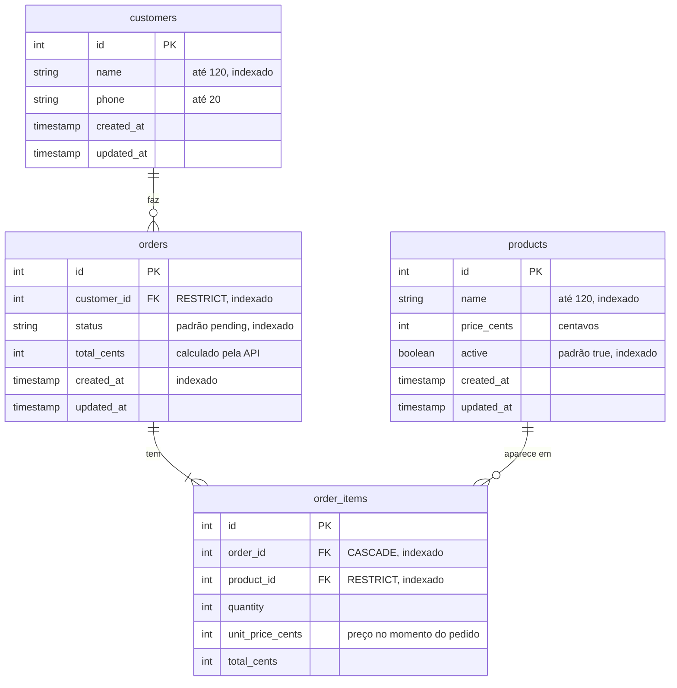

# Banco de dados

SQLite, arquivo em `backend/tmp/db.sqlite3` (testes usam `tmp/db.test.sqlite3`). Todo acesso passa pelo Lucid, o ORM do AdonisJS. As tabelas são criadas pelas migrations em `backend/database/migrations/`, que têm `up` e `down`.

## Diagrama



## Decisões de modelagem

**Dinheiro em centavos, inteiro.** `0.1 + 0.2` dá `0.30000000000000004` em ponto flutuante. Guardando `2500` em vez de `25.00`, toda soma e multiplicação é exata. A conversão para R$ acontece só na tela.

**`unit_price_cents` no item.** É a regra 6 do PDF. O item guarda uma cópia do preço no momento da compra. O preço atual continua no produto; o pedido não depende dele.

**`total_cents` no item e no pedido.** Poderia ser calculado na hora da leitura, mas guardar deixa o pedido como um registro fechado do que foi cobrado e evita recalcular a cada listagem. Os dois são escritos uma única vez, na criação, pelo `OrderService`.

**Chaves estrangeiras:**

| Relação | Ao apagar o pai | Por quê |
|---|---|---|
| `orders.customer_id → customers` | `RESTRICT` | Pedido sem cliente perde o sentido (regra 1) |
| `order_items.order_id → orders` | `CASCADE` | Item não existe sem o pedido |
| `order_items.product_id → products` | `RESTRICT` | O histórico precisa saber o que foi vendido. Produto sai de circulação sendo desativado, não apagado |

O SQLite vem com chaves estrangeiras desligadas. `config/database.ts` liga com `PRAGMA foreign_keys = ON` em cada conexão, para o banco garantir as relações e não só o código.

**`unique(order_id, product_id)`.** Um produto aparece uma vez por pedido; para levar mais, aumenta a quantidade. A API já recusa repetição na validação, e o índice garante no banco.

**Índices.** Nas colunas usadas em filtro, busca e ordenação: `orders.status`, `orders.customer_id`, `orders.created_at`, `products.active`, `products.name`, `customers.name`, e as chaves estrangeiras de `order_items`.

**`status` como texto** (`pending`, `preparing`, ...), não número. Fica legível numa consulta direta ao banco, e o conjunto de valores válidos é controlado pelo código em `app/domain/order_status.ts`.

## Models

Os models em `app/models/` declaram cada coluna (`@column`) em vez de usar o schema gerado automaticamente pelo AdonisJS 7, para que a modelagem possa ser lida no próprio model.

| Model | Relações | Detalhe |
|---|---|---|
| `Customer` | `hasMany(Order)` | Scope `search`: nome ou telefone |
| `Product` | — | `active` convertido para booleano (SQLite devolve 0/1). Scope `search`: nome |
| `Order` | `belongsTo(Customer)`, `hasMany(OrderItem)` | `status` tipado como `OrderStatus`. Scope `search`: número do pedido ou nome do cliente |
| `OrderItem` | `belongsTo(Order)`, `belongsTo(Product)` | Sem timestamps; o item nasce e morre com o pedido |

## Trocar de banco

O código não depende do SQLite. Para usar PostgreSQL: `npm install pg`, adicionar a conexão `pg` em `config/database.ts` e apontar `connection` para ela. As migrations e os models ficam iguais.

## Comandos

```bash
node ace migration:run          # cria as tabelas
node ace db:seed                # dados de exemplo
node ace migration:fresh --seed # apaga tudo e recria com dados de exemplo
node ace migration:rollback     # desfaz a última leva de migrations
```

O seed cria 4 clientes, 6 produtos (o "Hot dog especial" inativo) e 5 pedidos, um em cada status. Os pedidos passam pelo `OrderService`, então seguem exatamente as mesmas regras da API. Se já houver clientes no banco, o seed não faz nada.
