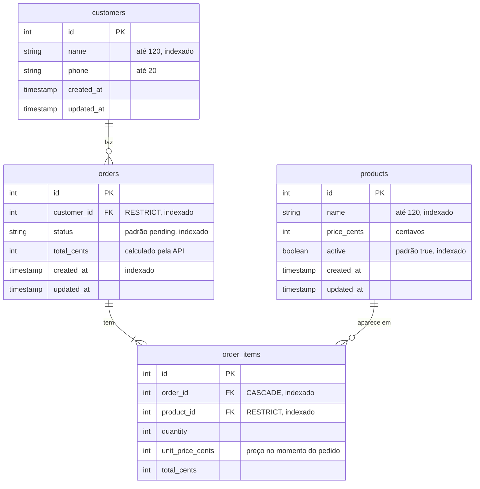

# Banco de dados

SQLite, arquivo em `backend/tmp/db.sqlite3` (testes usam `tmp/db.test.sqlite3`). Todo acesso passa pelo Lucid, o ORM do AdonisJS. As tabelas são criadas pelas migrations em `backend/database/migrations/`, que têm `up` e `down`.

## Diagrama



## Por que está modelado assim

Todo valor em dinheiro é inteiro em centavos: `2500`, não `25.00`. Em ponto flutuante `0.1 + 0.2` dá `0.30000000000000004`, e com inteiro toda soma e multiplicação sai exata. A conversão para R$ só acontece na tela.

`order_items.unit_price_cents` é a regra 6 do PDF. O item guarda o preço do momento da compra, e o preço de hoje continua no produto, sem que o pedido dependa dele. Os `total_cents` do item e do pedido também são gravados, uma vez só, na criação, pelo `OrderService`. Daria para calcular na leitura, mas o pedido é o registro do que foi cobrado e não deve mudar se a conta mudar.

As chaves estrangeiras seguem o que cada relação significa:

| Relação | Ao apagar o pai | Por quê |
|---|---|---|
| `orders.customer_id → customers` | `RESTRICT` | Pedido sem cliente perde o sentido (regra 1) |
| `order_items.order_id → orders` | `CASCADE` | Item não existe sem o pedido |
| `order_items.product_id → products` | `RESTRICT` | O histórico precisa saber o que foi vendido. Produto sai de circulação sendo desativado, não apagado |

O SQLite vem com chave estrangeira desligada, e `config/database.ts` liga com `PRAGMA foreign_keys = ON` em cada conexão. Sem isso, as relações só existiriam no código.

`unique(order_id, product_id)` impede o mesmo produto duas vezes no pedido: para levar mais, aumenta a quantidade. A API já recusa isso na validação, e o índice garante no banco.

Os índices estão nas colunas usadas para filtrar, buscar e ordenar: `orders.status`, `orders.customer_id`, `orders.created_at`, `products.active`, `products.name`, `customers.name` e as chaves estrangeiras de `order_items`.

`status` é texto (`pending`, `preparing`...), não número, para ficar legível numa consulta direta. Quem decide os valores válidos é o código, em `app/domain/order_status.ts`.

## Models

Os models em `app/models/` declaram cada coluna (`@column`) em vez de usar o schema gerado automaticamente pelo AdonisJS 7, para que a modelagem possa ser lida no próprio model.

| Model | Relações | Detalhe |
|---|---|---|
| `Customer` | `hasMany(Order)` | Scope `search`: nome ou telefone |
| `Product` | nenhuma | `active` convertido para booleano (SQLite devolve 0/1). Scope `search`: nome |
| `Order` | `belongsTo(Customer)`, `hasMany(OrderItem)` | `status` tipado como `OrderStatus`. Scope `search`: número do pedido ou nome do cliente |
| `OrderItem` | `belongsTo(Order)`, `belongsTo(Product)` | Sem timestamps; o item nasce e morre com o pedido |

## Trocar de banco

O código não depende do SQLite. Para usar PostgreSQL: `npm install pg`, adicionar a conexão `pg` em `config/database.ts` e apontar `connection` para ela. As migrations e os models ficam iguais.

## Comandos

```bash
node ace migration:run          # cria as tabelas
node ace db:seed                # dados de exemplo
node ace migration:fresh --seed # apaga tudo e recria com dados de exemplo
node ace migration:rollback     # desfaz a última leva de migrations
```

O seed cria 4 clientes, 6 produtos (o "Hot dog especial" inativo) e 5 pedidos, um em cada status. Os pedidos passam pelo `OrderService`, então seguem exatamente as mesmas regras da API. Se já houver clientes no banco, o seed não faz nada.
