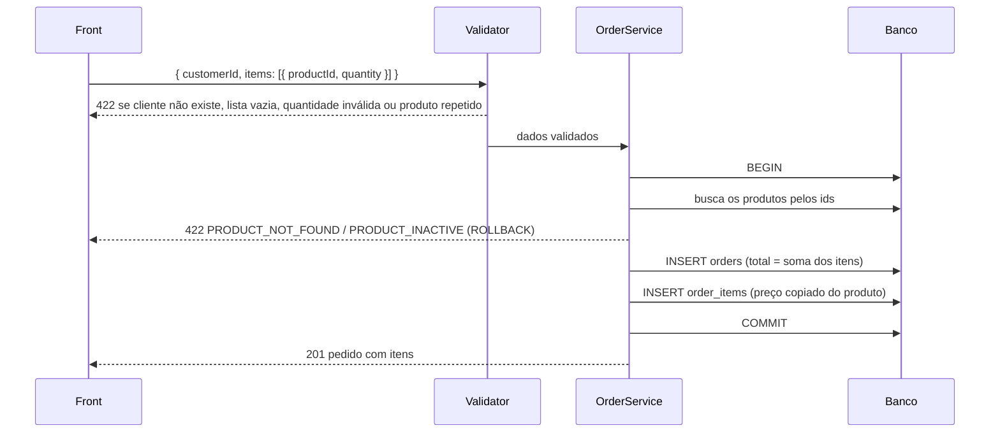
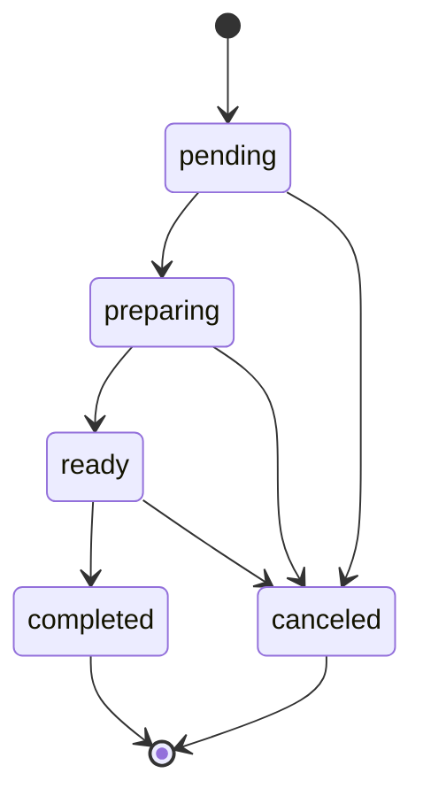

# Regras de negócio

As 8 regras do PDF, onde cada uma está no código e qual teste prova.

| # | Regra | Onde | Teste |
|---|---|---|---|
| 1 | Pedido precisa de cliente | `app/validators/order.ts`: `customerId` obrigatório com `exists` | `requires a customer` |
| 2 | Pelo menos um produto | `items` com `minLength(1)` | `requires at least one product` |
| 3 | Quantidade mínima 1 | `quantity` inteiro de 1 a 999 | `requires a quantity of at least 1`, `refuses a quantity above the limit or with decimals` |
| 4 | Produto inativo não entra em pedido novo | `OrderService.create` | `refuses inactive products and saves nothing`, `an order can be placed again after a product is reactivated` |
| 5 | Valor calculado pelo backend | `OrderService.create`: preço vem do banco | `calculates totals on the backend` (envia `totalCents: 1` e confere que foi ignorado) |
| 6 | Preço registrado no momento do pedido | `order_items.unit_price_cents` | `keeps the price paid when the product price changes later` |
| 7 | Pendente → Em preparação → Pronto → Finalizado, e cancelar | `app/domain/order_status.ts` | `walks through the whole flow`, `does not skip steps` + testes unitários |
| 8 | Cancelado não volta | `app/domain/order_status.ts` | `a canceled order cannot move to any other status` |

Os testes estão em `backend/tests/functional/orders.spec.ts` e `backend/tests/unit/order_status.spec.ts`.

## Criação do pedido



O front não manda preço, só `productId` e `quantity`. Se mandasse, qualquer pessoa editando a requisição no navegador pagaria o que quisesse.

Pedido e itens entram juntos ou nada entra. O teste `refuses inactive products and saves nothing` põe um produto inativo no meio e confere que nenhuma linha foi criada, nem em `orders` nem em `order_items`.

O preço de cada item é copiado do produto na hora da gravação (`unit_price_cents = product.price_cents`). O exemplo do PDF, o X-Burger que passa de R$ 25 para R$ 30, está num teste.

## Fluxo de status



| Status | Na tela | Pode ir para |
|---|---|---|
| `pending` | Pendente | `preparing`, `canceled` |
| `preparing` | Em preparação | `ready`, `canceled` |
| `ready` | Pronto | `completed`, `canceled` |
| `completed` | Finalizado | nenhum |
| `canceled` | Cancelado | nenhum |

A tabela está em `app/domain/order_status.ts`, no objeto `TRANSITIONS`. Para mudar o fluxo, muda essa tabela e mais nada: a validação, o `nextStatuses` e os botões do front seguem ela.

O PDF deixa duas coisas em aberto. As setas descrevem uma sequência, então pendente não vai direto para pronto e nada volta. E ele diz que cancelado não volta, mas não fala de cancelar pedido finalizado. Aqui finalizado também é final, porque pedido entregue não se cancela, se estorna. Se a leitura esperada for a outra, basta incluir `'canceled'` em `completed: []`.

## Dois atendentes no mesmo pedido

### 1. Tela desatualizada

1. Atendente A e atendente B abrem o pedido #7. Os dois veem "Pendente".
2. A clica em "Iniciar preparo". O pedido vai para `preparing`.
3. Um minuto depois, B, com a tela ainda mostrando "Pendente", clica em "Cancelar pedido".

Para a API, cancelar um pedido em preparação é permitido. Sem proteção, o pedido seria cancelado com a cozinha já trabalhando, e B nem saberia que ele tinha saído de "Pendente".

Por isso o front manda junto o status que está na tela: `{ "status": "canceled", "from": "pending" }`. Se o pedido não está mais em `from`, a API responde `409 ORDER_STATUS_CHANGED` e não muda nada. O front mostra o aviso e recarrega o pedido, e B decide de novo vendo o status real.

`from` é opcional na API, para não quebrar quem só manda `status`. O front sempre manda.

Teste: `refuses a change made from an outdated screen`.

### 2. Duas requisições ao mesmo tempo

Mesmo com `from`, a API faz duas coisas separadas: lê o pedido, confere a regra e só depois grava. Se duas requisições chegam juntas, as duas podem ler "pendente" antes de qualquer uma gravar, as duas passam na checagem e a segunda sobrescreve a primeira. Então a gravação em `OrderService.transition` só vale se o pedido ainda estiver no status que foi lido:

```sql
UPDATE orders SET status = 'canceled', updated_at = ...
WHERE id = 7 AND status = 'pending'
```

Se nenhuma linha foi alterada, outra requisição chegou antes, e a resposta é `409 ORDER_STATUS_CHANGED`. É um `UPDATE` só, então é atômico em qualquer banco, sem lock.

Teste: `a stale status change does not overwrite a newer one`.

Os dois testes falham quando a proteção correspondente é tirada do código. Isso foi conferido tirando.

## Validações além das regras

| Campo | Regra | Motivo |
|---|---|---|
| Telefone | 10 a 13 dígitos, aceitando `( ) - . +` e espaços | Aceita como as pessoas escrevem, recusa o que não é telefone |
| Preço | Inteiro, de 1 a 100.000.000 centavos | Produto de R$ 0,00 ou com fração de centavo não existe |
| Quantidade | Até 999 | Pega erro de digitação (1000 em vez de 10) |
| Itens | Sem produto repetido | Evita dois itens do mesmo produto com preços possivelmente diferentes |
| `perPage` | Até 100 | Ninguém pede um milhão de linhas numa requisição |
| Nomes | 2 a 120 caracteres, sem espaços nas pontas | |
